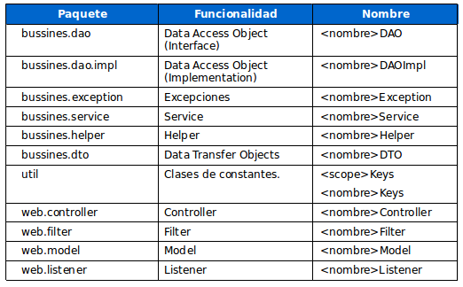

# Buenas prácticas para Java 

> Esta guia ha sido desarrollada para cualquier versión de Java

## Tabla de contenidos

- [Conceptos basicos](#Conceptos-basicos)
- [Lazy Initialitation](#lazy-initialitation)
- [Valores nulo](#valores-nulo)
- [Declaracion de variables](#Declaracion-de-variables)
- [Nomenclatura](#nomenclatura)
- [Comentarios de documentacion (JavaDoc)](#Comentarios-de-documentacion-(JavaDoc))


# Conceptos basicos

Al tratarse de proyectos maven generados a traves de arquetipos tiene una estructura de directorios reconocida, esto significa que debemos situar nuestras clases, tests o recursos en un lugar en concreto, 
para que luego Maven sea capaz de tratarlos correctamente.

Maven tiene cuatro carpetas fuente por defecto:

* src/main/java : donde guardaremos nuestras clases java fuente. Debajo de esta carpeta situaremos nuestras clases en distintos paquetes.
* src/main/resources : aquí almacenaremos los recursos (ficheros xml, ficheros de propiedades, imagenes, …) que pueda necesitar las clases java de nuestro proyecto. Igualmente aquí tienen que ir los ficheros de configuración de Spring o Hibernate por ejemplo.
* src/test/java : en dicha carpeta se guardan las clases de test que se encargarán de probar el correcto funcionamiento de nuestra aplicación. Aquí por ejemplo podemos guardar nuestros test unitarios de JUnit.
* src/test/resources : en esta carpeta guardamos los recursos que usan los test.

Pongamos por ejemplo como sería la estructura de un proyecto maven (simplificada).

```
src/
├── main/
│   ├── java/
│   │   └── com.bankia.ioi.activarContrato.carteraGestionada.v1_0.flow/
│   │   	├── action/
│   │   	│   └── ...
│   │   	├── assamble/
│   │   	│   └── ...
│   │   	├── constantes/
│   │   	│   └── ...
│   │   	├── dto/
│   │   	│   └── ...
│   │   	├── enrichment/
│   │   	│   └── ...│   │   	└── utilidades/
│   │   	    └── ...
│   ├── resources/
│   │   └── META-INF/
│   │   	├── spring/
│   │   	│   └── ...
│   │   	└── views/
│   │   	    └── ...
│   └─ webapp/
│       ├── WEB-INF/
│       │   └── ...
│       └── WEB-INF-LOCAL/
│           └── ...
│   
└── test/
    ├── java/
    │   └── ...
    └── resources/
        └── ...
 
```

## Lazy Initialitation

* Inicializar los objetos solo cuando sea necesario, de esa manera evitaremos sobrecargar la memoria de java.

```java
public class Paises {
 
    private List paises;
 
    public List getPaises() {
        //se inicializa solo cuando es requerido
        if(null == paises) {
            paises = new ArrayList();
        }
        return paises;
    }
}

```

## Valores nulo

Para un mejor rendimiento de la aplicación y evitar un montón de tiempo cuando hagas pruebas para valores nulos, es mejor devolver las colecciones o arreglos vacíos en lugar de nulos, ojo, siempre hay que controlar las excepciones.

## Declaracion de variables 

* Nunca declarar variables de instancia publica, por seguridad, mejor declararla como privada y crear getters y setters.

```java
/* Forma correcta y segura de declarar una variable */
public class vehiculo{

	private String marca;
	
	public String getMarca(){...}
	
	public void setMarca(String marca){...}
	
}

/* Forma incorrecta y poco segura, ya que se tiene acceso desde cualquier lado de la aplicación */
public class vehiculo{

	public String marca;
		
}

```
* Las variables booleanas negadas deben evitarse
``` java
boolean isError; // NOT: isNotError 
boolean isFound; // NOT: isNotFound
```
El problema surge cuando el operador lógico no se usa y surge una doble negación. No es muy claro inicialmente el significado de !isNotError.

## Nomenclatura

Cosas a tener en cuenta cuando vayamos a nombrar algo en Java.

* Los nombres de paquetes debería estar totalmente en minúsculas.
* Los nombres de constantes de clases deberían escribirse todo en mayúsculas con las palabras separadas por subrayados ("_"). Todas serán declaradas como public static final
```java
 public static final String PROPERTY_URL_SERVICIO = "urlServicio";
``` 	
* Los nombres que representan métodos deben ser verbos y escribirse con mayúsculas y minúsculas iniciando con minúscula.
* Utilizar JavaDoc para los métodos, además de ir insertando comentarios cada vez que creas que la lógica de un método puede llevar a confusión para los programadores que vengan detrás.
* Las declaraciones de clase deberían organizarse. Esto debería hacerse de la siguiente manera:
	1. Documentación de la Clase/Interface.
	2. Sentencia class o interface.
	3. Variables de clase (estáticas) en el orden public, protected, package (sin modificador de acceso), privadas.
	4. Variables de instancia en el orden public, protected, package (sin modificador de acceso), private.
	5. Constructores.
	6. Métodos (sin orden específico). 
* Los nombres de clases deben ser mezclas de mayúsculas y minúsculas, con la primera letra de cada palabra interna en mayúsculas (CamelCase).
* Debemos intentar mantener los nombres de clases simples y descriptivos.
* Debemos usar palabras completas y evitar acrónimos y abreviaturas (se permiten DAO, DTO, URL, HTML, etc.).
* Si la clase cumpliese algún patrón determinado o tuviese una funcionalidad específica es recomendable definirlo en el nombre.
* Aqui encontraremos una tabla con la nomenclatura habitual

.

## Comentarios de documentacion (JavaDoc)

> Como norma es obligatorio proporcionar un comentario de documentación por cada clase / interface, método, propiedad o constante creado.

Son obligatorios los siguientes comentarios de documentación:

* Comentario de la clase / interface:

	1. Prescripción genérica de la clase y su responsabilidad.
	2. Autor.

* Todas las variables tipo private o protected han de ser obligatoriamente comentadas.

* Reglas generales a la hora de escribir comentarios de documentación.

	1. Siempre se escribe en tercera persona.
	2. Los caracteres especiales tales como tildes y eñes se han de codificar con su código HTML correspondiente.
	3. Las descripciones siempre deberían empezar por un verbo.

* En cuanto a los tag's utilizados el orden de los mismos es el siguiente:
	
	1. @return este tag no aparece para aquellos métodos que retornan void. Por lo demás se comporta como el tag anterior
	2. @throws Descripción breve de la posible causa de la excepción.
	3. @see  Su uso queda restringido en cuanto a cantidad de los mismos como con el atributo @link.
	4. @param seguido de el nombre del parámetro e indentada la descripción del mismo. Usualmente esta descripción será una frase corta que comienza definiendo el tipo del parámetro.
```java
@param alturaCaja         Entero que define la altura de la caja en píxeles
@param longitudCaja     Flotante que define la longitud de la caja en píxeles
```

* Los demás tags permitidos (@since, @serial, etc..) el uso es menos común y por lo tanto no se define una manera de utilizarlos.
* Usar el atributo \<code> para las palabras reservadas de java, nombres de clases, métodos, interfaces, propiedades, argumentos y ejemplos de código.
* El uso del atributo @link tendrá que ser mínimo, para evitar llenar el documento de enlaces. Como norma general solo se incluirán links cuando la referencia sea necesaria y sólo en la primera aparición de la misma.
* Para distinguir entre dos métodos con el mismo nombre pero diferentes parámetros de entrada se utilizaran el nombre del método seguido por los argumentos del mismo entre paréntesis.


## Consejos

### Evitar el uso de variables globales.

Una variable global es una variable colocada fuera del ámbito de varias funciones y que es globalmente accesible por todas ellas. No se debe confundir con un atributo de una clase, que es un campo dentro de un registro que varias funciones manipulan. Un consejo útil para distinguir atributos de variables globales es pensar si la variable corresponde a una característica identificable del conjunto de individuos representado por una clase.
El uso de variables globales pueda resultar tentador por lo cómodo de evitar tener que estar pasando la variable global como parámetro. Sin embargo, el uso de variables globales puede tener efectos laterales bastante peligrosos. El problema es que al ser la variable globalmente accesible, ésta puede, por malicia o simple infortunio, ser modificada fácilmente por terceras funciones, asignando a la variable un valor no deseado. Este valor no deseado puede desecandenar una serie de fallos en cadena. Al ser la variable accesible por un número potencialmente largo de funciones, una vez producido el fallo, depurar el programa hasta averiguar cual es la causa del fallo puede ser un proceso largo y tedioso. En muchas Escuelas de Ingeniería Informática el uso no justificado de variables globales es causa directa de suspenso en un examen o práctica de programación.


### Evitar el uso de sentencias goto, break y continue.

Evitar el uso de sentencias que rompan el flujo secuencial de ejecución de un programa es el principio básico de la programación estructurada. Las sentencias tipo goto dificultan la legibilidad, depuración y verificación de programas, al permitir a la ejecución de un programa realizar saltos arbitrarios. Aquellas funciones que hacen uso de sentencias goto son mucho más difíciles de reutilizar y depurar.
El uso de sentencias break y continue suele estar asociado a técnicas de construcción de bucles artesanales, donde primero se codifica un bucle y luego se comprueba su correción mediante prueba y error usando depuración. El no usar estas sentencias obliga normalmente a pensar primero que condición o invariante debe cumplirse durante la ejecución del bucle, y a continuación codificar el bucle. Esta segunda técnica resulta mucho más ingenieril, es la base para la posterior verificación formal del bucle y suele contribuir a mejorar la legibilidad de los programas.
Comentar finalmente, que las sentencias break y continue son versiones degeneradas de la sentencia goto. La misión principal de estas instrucciones es forzar la salida de un bucle o su continuación. Si el programa fuese modificado y las sentencias break o continue quedasen anidadas dentro de nuevos bucles, éstas podrían dejar de cumplir su función. Al modificar el programa las sentencias break y continue podrían salir de, o continuar con, un bucle que no es el deseado, respectivamente. En ambos casos, la aplicación presentaría un comportamiento no deseado.

### Usar un único return por función, que se colocará como última sentencia de la función.

Este consejo es una consecuencia de uno de los principios de la programación estructurada. Dicho principio establece que los programas deberían tener un único punto de entrada y un sólo punto de salida. Además, enlazando con el consejo anterior, un return puede considerarse como un GOTO hacia el final de la función. El uso de un único return por función, colocado consecuentemente al final de la misma, facilita tanto la depuración como la adaptabilidad de los programas.

### Evitar escribir funciones y procedimientos demasiado largas.

Ello dificulta su legibilidad y comprensión y por tanto, su mantenimiento. En general, en funciones demasiado largas hay trozos claramente diferenciados de código, débilmente acoplados. Cada uno de estos bloques suele realizar una tarea distinta. Por ejemplo, es habitual en muchas funciones que al principio se preparen los datos para realizar un cómputo, o se inicialice alguna estrucura. A continuación se realizan una serie de cálculos y por último se presenten por la salida los resultados.
En ese caso, por ejemplo, se recomienda dividir la función en tres subfunciones inicializa(..), calcular(..) e imprimir(..). No importa que las expectativas iniciales de reutilización de estas funciones sean prácticamente nulas. En general, si dos trozos de código pueden aparecer juntos en una sola función o separados en dos subfunciones, la opción recomendada siempre es separarlos.


### Evitar copiar y pegar trozos cuasiidénticos de código a lo largo de una aplicación software.

Si un trozo de código, por ejemplo, una serie de sentencias destinadas a impimir una matriz por pantalla, se copia y pega cada vez que se necesite dicha funcionalidad, el resultado será una aplicación con bloques idénticos de código dispersos a través de múltiples lugares de una aplicación software. El principal problema viene cuando hay que modificar este bloque de código. Por ejemplo, si simplemente queremos añadir un recuadro a la matriz, deberemos modificar de la misma forma múltiples puntos de nuestra aplicación, lo que es propenso a errores y puede provocar problemas de consistencia. En lugar de copiar y pegar trozos de codigo, la práctica recomendada es encapsular dicho trozo de código en una función e invocarla cuando se necesite.

### Colocar al lado de una llave que cierre un bloque de código un indicativo de que tipo de estructura cierra.

Es común cuando se anidan diversos bloques de código encontrarse con líneas de código que simplemente sean una secuencia de cierre de llaves tipo }}}}. En estos casos, es muy fácil perder la pista de que tipo de bloque de código o estructura cierra cada llave. Por tanto, se aconseja poner al lado de cada llave algún comentario que indique que tipo de estructura o bloque de código se cierra.
La práctica habitual es usar: (1) el nombre del tipo de estructura de control que cierra; (2) el nombre de la función, en el caso del cierre defunciones; (3) el nombre de la clase, registro o módulo, en sus respectivos casos. Esto ayuda a asociar cada llave con la estructura que cierra.


### Las clases Exception deberían tener como sufijo Exception

Esto mejora la legibilidad dado que el nombre da al usuario la impresión inmediata del tipo de variable y por consiguiente los recursos disponibles del objeto.
